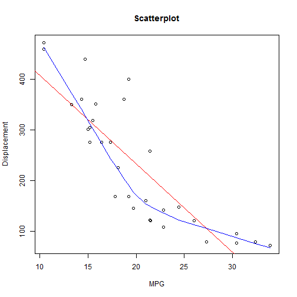

## Introduction

This shiny app is intended to explore the mtcars dataset.  Exploring and understanding a dataset is fundamental data science.  This app, while simple, provides a quick view of mtcars that can be used to visualize and evaluate the variables and correlation among them.

[ShinyApp Link](https://www.shinyapps.io/admin/#/application/64986)

[GitHub Link](https://github.com/isustate/DDP)

--- .class #id 

## Inspecting the Data 

It is recommended to preview a few lines of data to evaluate if variables and values populated accordingly.  The slider allows the user to show more/fewer rows to examine the mtcars dataset.  The slider is set to show up to the full dataset in increments of 4 rows.  After adjusting the slide, you will notice the rows automatically update.  The app takes the slider value and runs the  the head function.  The example below shows results with 5 lines.   


```r
dataset <- mtcars
head(dataset, n = 5L)
```

```
##                    mpg cyl disp  hp drat    wt  qsec vs am gear carb
## Mazda RX4         21.0   6  160 110 3.90 2.620 16.46  0  1    4    4
## Mazda RX4 Wag     21.0   6  160 110 3.90 2.875 17.02  0  1    4    4
## Datsun 710        22.8   4  108  93 3.85 2.320 18.61  1  1    4    1
## Hornet 4 Drive    21.4   6  258 110 3.08 3.215 19.44  1  0    3    1
## Hornet Sportabout 18.7   8  360 175 3.15 3.440 17.02  0  0    3    2
```

--- .class #id 

## Analyzing a Variable
Before running an analysis, best to explore each variable.  After the user chooses the variable, it will generate a summary of values along with histogram.  The code below shows the results if mpg was chosen in the variable of interest field.


```r
summary(dataset$mpg)
```

```
##    Min. 1st Qu.  Median    Mean 3rd Qu.    Max. 
##   10.40   15.42   19.20   20.09   22.80   33.90
```

To understand the relationships within the data, correlations should be checked.  After selecting both the variable of interest and variable to check correlation with, a scatter plot with fit lines is displayed.  The code on the next slide shows the scatterplot that is generated for mpg and displacment.

--- .class #id 

## Correlations with other Variables 


```r
plot(dataset$mpg, dataset$disp, main = 'Scatterplot',xlab='MPG', ylab = 'Displacement')
abline(lm(dataset$disp~dataset$mpg), col="red")
lines(lowess(dataset$mpg,dataset$disp), col="blue")
```

 

--- .class #id  
